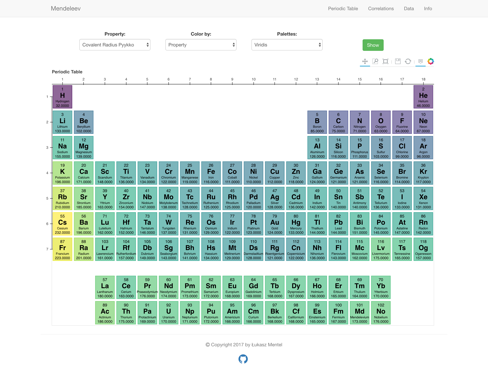
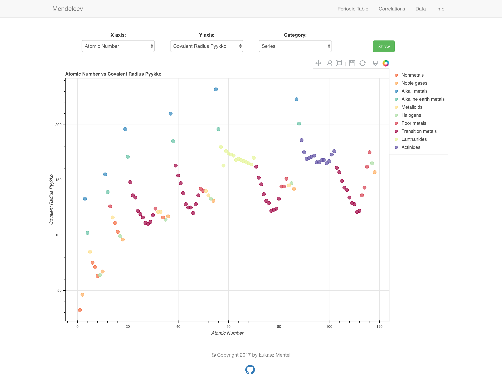

[](https://mendeleev.readthedocs.org)
[](https://pypi.python.org/pypi/mendeleev)
[](https://opensource.org/licenses/MIT)
[](https://anaconda.org/lmmentel/mendeleev)
[](https://github.com/lmmentel/mendeleev/actions/workflows/main.yml)
[](https://lgtm.com/projects/g/lmmentel/mendeleev/alerts/)
[](https://lgtm.com/projects/g/lmmentel/mendeleev/context:python)
[](https://pepy.tech/project/mendeleev)


<!-- PROJECT LOGO -->
<br />
<p align="center">
  <a href="https://github.com/lmmentel/mendeleev">
    
  </a>

  <h3 align="center">Pythonic periodic table of elements</h3>

  <p align="center">
    A package with a convenient python API for accessing various properties
of elements, ions and isotopes in the periodic table of elements.
    <br />
    <br />
    <a href="https://github.com/lmmentel/mendeleev/issues">Report Bug</a>
    ·
    <a href="https://github.com/lmmentel/mendeleev/issues">Request Feature</a>
    ·
    <a href="https://github.com/lmmentel/mendeleev/pulls">Submit a Pull Request</a>
  </p>
</p>


<!-- TABLE OF CONTENTS -->
## Table of Contents

- [Table of Contents](#table-of-contents)
- [About the project](#about-the-project)
  - [Interactive web app](#interactive-web-app)
- [Installation](#installation)
- [Documentation](#documentation)
- [Data](#data)
  - [Basic properties](#basic-properties)
  - [Standardized colors schemes](#standardized-colors-schemes)
  - [Size related properties](#size-related-properties)
  - [Electronegativity scales](#electronegativity-scales)
  - [Descriptive properties](#descriptive-properties)
  - [Physical properties](#physical-properties)
  - [Computed properties](#computed-properties)
  - [Isotope properties](#isotope-properties)
- [Getting started](#getting-started)
  - [Lists of elements](#lists-of-elements)
    - [Isotopes](#isotopes)
  - [Accesing data tables and the database](#accesing-data-tables-and-the-database)
  - [Command line interface utility](#command-line-interface-utility)
- [Contributing](#contributing)
  - [Issues](#issues)
  - [Pull requests](#pull-requests)
- [License](#license)
- [Citing](#citing)
- [Funding](#funding)

---

source: [https://github.com/lmmentel/mendeleev](https://github.com/lmmentel/mendeleev)

---

<h2> Important! </h2>

Version 0.5.1 will be the latest version to support Python2.7.

**This package has been migrated from bitbucket.**

**The bitbucket repo is no longer being maintaned and development will
continue at github.**

---

## About the project

This package provides a convenient python API for accessing various
properties of elements, ions and isotopes in the periodic table of
elements.

Moreover it provides an easy to use interface to
[pandas](http://pandas.pydata.org/) and convenient visualization
functionality through [bokeh](http://bokeh.pydata.org/en/latest/) that
enables you to create customized periodic tables displaying various
properties.


Django Extensions is free and always will be. It is development and maintained by developers in an Open Source manner. Any support is welcome. You could help by writing documentation, pull-requests, report issues and/or translations.
iodic trends in the periodic tables. If you want to
look at some examples there are a few
[tutorials](http://mendeleev.readthedocs.io/en/stable/tutorials.html)
available as [jupyter notebooks](http://jupyter.org/).

### Interactive web app

If you would like to explore the data available in
[mendeleev](http://mendeleev.readthedocs.org) check out the interactive
web app at [mendeleev.herokuapp.com](http://mendeleev.herokuapp.com/)
where you can create your own periodic tables and visualize the
relations between various properties of elements.





## Installation

The preferred installation method is with
[conda](https://conda.io/docs/intro.html) and you can install the
package from the [conda-forge](https://conda-forge.org/) channel by

``` {.sourceCode .bash}
conda install -c conda-forge mendeleev=0.5.2
```

The package can also be installed using
[pip](https://pypi.python.org/pypi/pip)

``` {.sourceCode .bash}
pip install mendeleev
```
or [pipenv](https://pipenv.readthedocs.io/en/latest/)

``` {.sourceCode .bash}
pipenv install mendeleev
```

You can also install the most recent version from the repository:

``` {.sourceCode .bash}
pip install git+https://github.com/lmmentel/mendeleev.git
```

## Documentation

Full documentation is hosted on [Read the Docs](http://mendeleev.readthedocs.org/en/latest/).

There are also tutorials available as `Jupyter <https://jupyter.org/>`_
notebooks on `binder <https://mybinder.org/>`_ where you can explore the examples interactively:

* `Quick start <https://mybinder.org/v2/gh/lmmentel/mendeleev/master?filepath=docs%2Fsource%2Fnotebooks%2Fquick_start.ipynb>`_
* `Bulk data access <https://mybinder.org/v2/gh/lmmentel/mendeleev/master?filepath=docs%2Fsource%2Fnotebooks%2Fbulk_data_access.ipynb>`_
* `Electronic Configuration <https://mybinder.org/v2/gh/lmmentel/mendeleev/master?filepath=docs%2Fsource%2Fnotebooks%2Felectronic_configuration.ipynb>`_
* `Ions <https://mybinder.org/v2/gh/lmmentel/mendeleev/master?filepath=docs%2Fsource%2Fnotebooks%2Fions.ipynb>`_
* `Visualizations <https://mybinder.org/v2/gh/lmmentel/mendeleev/master?filepath=docs%2Fsource%2Fnotebooks%2Fvisualizations.ipynb>`_
* `Advanced visualizations <https://mybinder.org/v2/gh/lmmentel/mendeleev/master?filepath=docs%2Fsource%2Fnotebooks%2Fadvanced_visualizations.ipynb>`_


## Data

A comprehensive list of the available data together with appropriate
references are available in the
[documentation](http://mendeleev.readthedocs.org). Here the most
important entries are listed:

### Basic properties

- atomic number
- atomic weight
- block
- cas
- electrons
- electronic configuration
- group
- name
- neutrons
- period
- protons
- series
- symbol

### Standardized colors schemes

-   cpk\_color
-   jmol\_color
-   molcas\_gv\_color

### Size related properties

-   atomic radius (Slater, Rahm)
-   covalent radius (Bragg, Cordero, Pyykko)
-   ionic radius
-   metallic radius
-   van der Waals radius (Alvarez, Batsanov, Bondi, Dreiding, MM3, RT,
    Truhlar, UFF)

### Electronegativity scales

-   Allen
-   Allred & Rochow
-   Cottrell & Sutton
-   Ghosh
-   Gordy
-   Li & Xue
-   Nagle
-   Martynov & Batsanov
-   Mulliken
-   Pauling
-   Sanderson

### Descriptive properties

-   discoverers
-   discovery location
-   dipole year
-   description
-   name origin
-   sources
-   uses

### Physical properties

-   boiling point
-   C\<sub\>6\</sub\>
-   density
-   dipole polarizability
-   electron affinity
-   evaporation heat
-   gas basicity
-   ionization energies
-   lattice structure
-   melting point
-   oxidation states
-   proton affinity
-   specific heat
-   thermal conductivity
-   nuclear screening constants (Slater & Clementi)

### Computed properties

-   hardness
-   softness
-   electrophilicity

### Isotope properties

-   abundance
-   g\_factor
-   half\_life
-   radioactivity
-   mass
-   mass number
-   spin
-   quadrupole\_moment

## Getting started

The simplest way of accessing the element data is by importing elements
directly from the [mendeleev]{.title-ref} package by their symbols. For
example consider iron (Fe):

    >>> from mendeleev import Fe
    >>> Fe.name
    'Iron'
    >>> Fe.atomic_number
    26
    >>> Fe.thermal_conductivity
    80.4

Another, more flexible way is through the `element` method that returns
the `Element` object:

    >>> from mendeleev import element

The `element` method accepts unique identifiers: atomic number, atomic
symbol or element\'s name in english. To retrieve the entries on Silicon
by symbol type

``` {.sourceCode .python}
>>> si = element('Si')
>>> si.name
'Silicon'
```

Similarly to access the data by atomic number or element names type

``` {.sourceCode .python}
>>> al = element(13)
>>> al.name
'Aluminium'
>>> o = element('Oxygen')
>>> o.atomic_number
8
```

### Lists of elements

The `element` method also accepts list or tuple of identifiers and then
returns a list of `Element` objects

``` {.sourceCode .python}
>>> c, h, o = element(['C', 'Hydrogen', 8])
>>> c.name, h.name, o.name
('Carbon', 'Hydrogen', 'Oxygen')
```

#### Isotopes

The `isotopes` attribute returns a list of `Isotope` objects with the
following attributes per isotope

-   `atomic_number`
-   `mass`
-   `abundance`
-   `mass_number`

``` {.sourceCode .python}
>>> fe = element('Fe')
>>> for iso in fe.isotopes:
...     print(iso)
 26   55.93494  91.75%    56
 26   56.93540   2.12%    57
 26   57.93328   0.28%    58
 26   53.93961   5.85%    54
```

The columns represent the attributes `atomic_number`, `mass`,
`abundance` and `mass_number` respectively.

### Accesing data tables and the database

[mendeleev](http://mendeleev.readthedocs.org) offers also methods for
accessing whole tables of data, e.g. table with the data on all isotopes
and methods for interacting directly with the database engine, for more
details see the [API
documentation](https://mendeleev.readthedocs.io/en/stable/code.html#accessing-data)
and [this
tutorial](https://mendeleev.readthedocs.io/en/stable/notebooks/02_tables.html).

### Command line interface utility

For those who work in the terminal there is a simple command line
interface (CLI) for printing the information about a given element. The
script name is [element.py]{.title-ref} and it accepts either the symbol
or name of the element or it\'s atomic number as an argument and prints
the data about it. For example, to print the properties of silicon type

``` {.sourceCode .bash}
$ element.py Si
                            _  _  _  _      _
                          _(_)(_)(_)(_)_   (_)
                         (_)          (_)_  _
                         (_)_  _  _  _  (_)(_)
                           (_)(_)(_)(_)_   (_)
                          _           (_)  (_)
                         (_)_  _  _  _(_)_ (_) _
                           (_)(_)(_)(_) (_)(_)(_)


Description
===========

  Metalloid element belonging to group 14 of the periodic table. It is
  the second most abundant element in the Earth's crust, making up 25.7%
  of it by weight. Chemically less reactive than carbon. First
  identified by Lavoisier in 1787 and first isolated in 1823 by
  Berzelius.

Sources
=======

  Makes up major portion of clay, granite, quartz (SiO2), and sand.
  Commercial production depends on a reaction between sand (SiO2) and
  carbon at a temperature of around 2200 °C.

Uses
====

  Used in glass as silicon dioxide (SiO2). Silicon carbide (SiC) is one
  of the hardest substances known and used in polishing. Also the
  crystalline form is used in semiconductors.

Properties
==========

Abundance crust                                         282000
Abundance sea                                              2.2
Annotation
Atomic number                                               14
Atomic radius                                              132
Atomic radius rahm                                         232
Atomic volume                                             12.1
Atomic weight                                           28.085
Atomic weight uncertainty                                  NaN
Block                                                        p
Boiling point                                             2628
C6                                                         305
C6 gb                                                      308
Cas                                                  7440-21-3
Covalent radius bragg                                      117
Covalent radius cordero                                    111
Covalent radius pyykko                                     116
Covalent radius pyykko double                              107
Covalent radius pyykko triple                              102
Covalent radius slater                                     110
Cpk color                                              #daa520
Density                                                   2.33
Dipole polarizability                                    37.31
Discoverers                                     Jöns Berzelius
Discovery location                                      Sweden
Discovery year                                            1824
Electron affinity                                      1.38952
Electronic configuration                          [Ne] 3s2 3p2
En allen                                                 11.33
En ghosh                                              0.178503
En pauling                                                 1.9
Evaporation heat                                           383
Fusion heat                                               50.6
Gas basicity                                             814.1
Geochemical class                                        major
Goldschmidt class                                    litophile
Group id                                                    14
Heat of formation                                          450
Is monoisotopic                                           None
Is radioactive                                           False
Jmol color                                             #f0c8a0
Lattice constant                                          5.43
Lattice structure                                          DIA
Melting point                                             1683
Metallic radius                                            117
Metallic radius c12                                        138
Molcas gv color                                        #f0c8a0
Name                                                   Silicon
Name origin                    Latin: silex, silicus, (flint).
Period                                                       3
Proton affinity                                            837
Series id                                                    5
Specific heat                                            0.703
Symbol                                                      Si
Thermal conductivity                                       149
Vdw radius                                                 210
Vdw radius alvarez                                         219
Vdw radius batsanov                                        210
Vdw radius bondi                                           210
Vdw radius dreiding                                        427
Vdw radius mm3                                             229
Vdw radius rt                                              NaN
Vdw radius truhlar                                         NaN
Vdw radius uff                                           429.5
```

## Contributing

`mendeleev` is free and always will be. It is developed and maintained by developers in an Open Source manner.
**Any contributions are welcome**. You could help by writing documentation, pull-requests, report issues or suggesting new features.

### [Issues](https://github.com/lmmentel/mendeleev/issues)

Feel free to submit [issues](https://github.com/lmmentel/mendeleev/issues) regarding:

-   data updates and recommendations
-   enhancement requests and new useful features
-   code bugs
-   data or citation inconsistencies or errors

### [Pull requests](https://github.com/lmmentel/mendeleev/pulls)

-   before stating to work on your pull request please [submit an
    issue](https://github.com/lmmentel/mendeleev/issues) first
-   fork the repo on [github](https://github.com/lmmentel/mendeleev)
-   clone the project to your own machine
-   commit changes to your own branch
-   push your work back up to your fork
-   submit a [pull request](https://github.com/lmmentel/mendeleev/pulls)
    so that your changes can be reviewed

## License

The packegs is release under the persmissive MIT license, see [LICENSE](https://github.com/lmmentel/mendeleev/blob/master/LICENSE)

## Citing

If you use [mendeleev](http://mendeleev.readthedocs.org) in a scientific
publication, please consider citing the software as

|    L. M. Mentel, *mendeleev* - A Python resource for properties of
  chemical elements, ions and isotopes. , 2014\-- . Available at:
  <https://github.com/lmmentel/mendeleev>.

Here\'s the reference in the
[BibLaTeX](https://www.ctan.org/pkg/biblatex?lang=en) format

``` {.sourceCode .latex}
@software{mendeleev2014,
   author = {Mentel, Łukasz},
   title = {{mendeleev} -- A Python resource for properties of chemical elements, ions and isotopes},
   url = {https://github.com/lmmentel/mendeleev},
   version = {0.8.0},
   date = {2014--},
```

> }

or the older [BibTeX](http://www.bibtex.org/) format

``` {.sourceCode .latex}
@misc{mendeleev2014,
   auhor = {Mentel, Łukasz},
   title = {mendeleev} -- A Python resource for properties of chemical elements, ions and isotopes, ver. 0.8.0},
   howpublished = {\url{https://github.com/lmmentel/mendeleev}},
   year  = {2014--},
}
```

## Funding

This project was supported by the RCN (The Research Council of Norway)
project number 239193.
