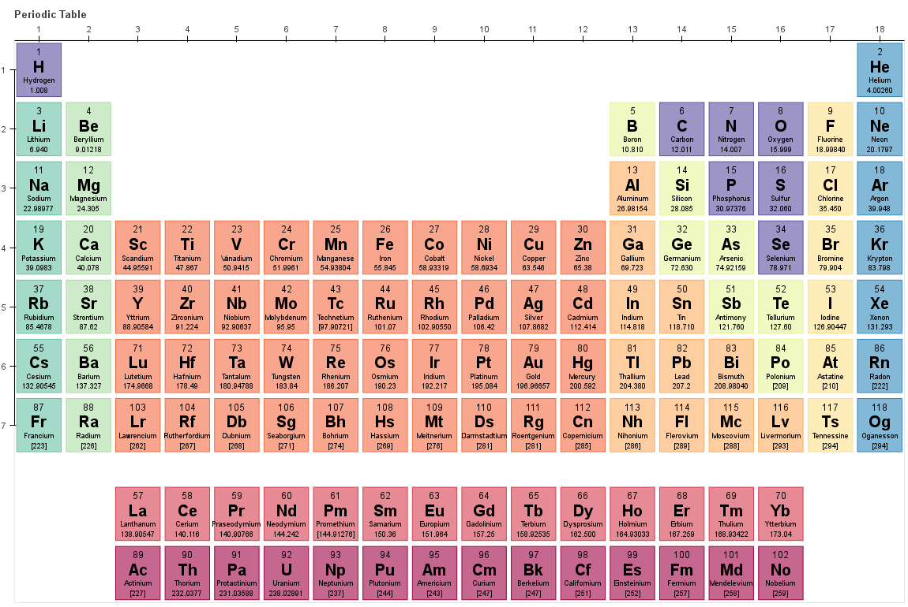

.. _mendeleev:

====================================
Welcome to mendeleev's documentation
====================================

This package provides an API for accessing various properties of elements from
the periodic table of elements.

Contents
========

.. toctree::
   :maxdepth: 2

   Data <data>
   Installation <install>
   Tutorials <tutorials>
   Electronegativity <electronegativity>
   API Reference <code>
   License <license_link>

******
Citing
******

If you use *mendeleev* in a scientific publication, please consider citing the software as

|    L. M. Mentel, *mendeleev* - A Python resource for properties of chemical elements, ions and isotopes. , 2014-- . Available at: `https://bitbucket.org/lukaszmentel/mendeleev <https://bitbucket.org/lukaszmentel/mendeleev>`_.

Here's the reference in the `BibLaTeX <https://www.ctan.org/pkg/biblatex?lang=en>`_ format

.. code-block:: latex

   @software{mendeleev2014,
      author = {Mentel, Łukasz},
      title = {{mendeleev} -- A Python resource for properties of chemical elements, ions and isotopes},
      url = {https://bitbucket.org/lukaszmentel/mendeleev},
      version = {0.3.6},
      date = {2014--},
  }

or the older `BibTeX <http://www.bibtex.org/>`_ format

.. code-block:: latex

   @misc{mendeleev2014,
      auhor = {Mentel, Łukasz},
      title = {mendeleev} -- A Python resource for properties of chemical elements, ions and isotopes, ver. 0.3.6},
      howpublished = {\url{https://bitbucket.org/lukaszmentel/mendeleev}},
      year  = {2014--},
   }

*******
Funding
*******

This project is supported by the RCN (The Research Council of Norway) project
number 239193.

******
Issues
******

If you would like to suggest an improvement or report a bug or data inconsistency please consider creating an
`issue on bitbucket <https://bitbucket.org/lukaszmentel/mendeleev/issues>`_.
I would be especially grateful for references to possible data updates and sources and recommendations of new data.

Indices and tables
==================

* :ref:`genindex`
* :ref:`modindex`
* :ref:`search`
