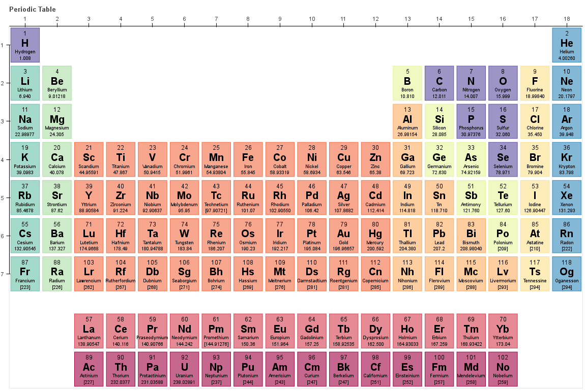

.. _mendeleev:

************************************
Welcome to mendeleev's documentation
************************************

.. raw:: html

   

**Pythonic periodic table of elements**

A Python package with a convenient API for accessing various properties of elements, ions, and isotopes
in the periodic table. Visualize trends, explore chemical data, and integrate periodic table information
into your scientific workflows.

.. raw:: html

   

      
      
      
      
   

Why mendeleev?
==============

🎯 **For Researchers & Scientists**
   Access peer-reviewed elemental data programmatically in your computational chemistry, materials science, or data science workflows. No more manual lookups or spreadsheet wrangling.

💡 **For Educators & Students**
   Explore periodic trends interactively, create custom visualizations, and integrate chemical data into Jupyter notebooks for teaching and learning.

⚙️ **For Developers**
   Simple, well-documented API with pandas integration. SQLAlchemy models for advanced queries. Type hints and unit support for production-ready code.

🔬 **Trusted Data Sources**
   All data comes from peer-reviewed scientific literature with proper citations. See our :doc:`bibliography <bibliography>` for complete references.

Quick Start
===========

See the :doc:`Quick Start guide <quick>` for copy-paste examples, or
:doc:`install` for installation options.

.. code-block:: python

   from mendeleev import element

   si = element("Si")
   print(si.name)           # Silicon
   print(si.atomic_number)  # 14

Key Features
============

📊 **Rich Dataset** → :doc:`data`
   100+ properties per element including atomic, physical, thermodynamic, and electronic data from peer-reviewed sources

🔬 **Isotope Information** → :doc:`data`
   Complete isotope data with abundances, masses, half-lives, decay modes, and nuclear properties

📏 **Units Support** → :doc:`units`
   Integration with `pint <https://pint.readthedocs.io/>`_ for unit-aware calculations and conversions (v1.1.0+)

📈 **Visualization** → :doc:`tutorials`
   Create custom periodic tables with `bokeh <https://bokeh.org/>`_, `plotly <https://plotly.com/>`_, and `seaborn <https://seaborn.pydata.org/>`_

🗄️ **Data Access** → :doc:`data_access`
   Query the SQLite database directly, export to pandas DataFrames, or use SQLAlchemy ORM for advanced queries

⚡ **Multiple Access Methods** → :doc:`api_overview`
   Access by symbol, name, atomic number, or perform bulk queries with filtering

🐍 **Pythonic API** → :doc:`api/api`
   Clean, intuitive interface with type hints, docstrings, and extensive examples

📚 **Well Documented** → :doc:`tutorials`
   Comprehensive documentation with interactive Jupyter notebook tutorials and API reference

🧪 **Electronegativity Scales** → :doc:`electronegativity`
   Calculate electronegativity using 14+ different scales (Pauling, Allred-Rochow, Mulliken, etc.)

🔓 **Open Source** → :doc:`CONTRIBUTING`
   MIT licensed, actively maintained, with contributions welcome

Explore the Documentation
==========================

Getting Started
---------------

New to mendeleev? Start here!

.. grid:: 2

   .. grid-item-card:: 📖 Installation Guide
      :link: install
      :link-type: doc

      Step-by-step installation instructions for conda, pip, and development setup.

   .. grid-item-card:: 🚀 Tutorials
      :link: tutorials
      :link-type: doc

      Interactive Jupyter notebooks covering common use cases and advanced features.

Data & Features
---------------

Learn what data is available and how to use it.

.. grid:: 2

   .. grid-item-card:: 🔢 Available Data
      :link: data
      :link-type: doc

      Comprehensive list of 100+ element properties with references and metadata.

   .. grid-item-card:: 📊 Accessing Data
      :link: data_access
      :link-type: doc

      Query elements, fetch tables, export to pandas, and work with the database.

   .. grid-item-card:: 📏 Units Support
      :link: units
      :link-type: doc

      Work with physical units using pint integration (v1.1.0+).

   .. grid-item-card:: ⚡ Electronegativity
      :link: electronegativity
      :link-type: doc

      Calculate electronegativity using 14+ different scales and methods.

API Documentation
-----------------

Detailed API reference and architecture.

.. grid:: 2

   .. grid-item-card:: 🏗️ API Overview
      :link: api_overview
      :link-type: doc

      Architecture, usage patterns, and decision flowchart for choosing the right approach.

   .. grid-item-card:: 📚 API Reference
      :link: api/api
      :link-type: doc

      Complete reference for all modules, classes, and functions.

Help & Resources
----------------

Get help and contribute to the project.

.. grid:: 2

   .. grid-item-card:: ❓ FAQ
      :link: faq
      :link-type: doc

      Frequently asked questions about installation, usage, and development.

   .. grid-item-card:: 🔧 Troubleshooting
      :link: troubleshooting
      :link-type: doc

      Common issues and solutions for data access, performance, and visualization.

   .. grid-item-card:: 🤝 Contributing
      :link: CONTRIBUTING
      :link-type: doc

      Learn how to contribute code, report bugs, and suggest enhancements.

   .. grid-item-card:: 📖 Bibliography
      :link: bibliography
      :link-type: doc

      Data sources and references used in mendeleev.

Community & Support
===================

.. grid:: 3

   .. grid-item-card:: 💬 Discussions
      :link: https://github.com/lmmentel/mendeleev/discussions

      Ask questions, share ideas, and connect with other users.

   .. grid-item-card:: 🐛 Issue Tracker
      :link: https://github.com/lmmentel/mendeleev/issues

      Report bugs, request features, or discuss data updates.

   .. grid-item-card:: 📚 Source Code
      :link: https://github.com/lmmentel/mendeleev

      Browse the source code, contribute, or fork the project.

Citing mendeleev
================

If you use mendeleev in your research, see :doc:`citing` for citation formats and BibTeX entries.

.. toctree::
   :caption: Getting Started
   :maxdepth: 2
   :hidden:

   Quick Start <quick>
   Installation <install>
   Tutorials <tutorials>

.. toctree::
   :caption: Data & Features
   :maxdepth: 2
   :hidden:

   Data <data>
   Accessing data <data_access>
   Units <units>
   Electronegativity <electronegativity>

.. toctree::
   :caption: API Reference
   :maxdepth: 2
   :hidden:

   API Overview <api_overview>
   API Reference <api/api>

.. toctree::
   :caption: Community & Help
   :maxdepth: 2
   :hidden:

   FAQ <faq>
   Troubleshooting <troubleshooting>
   Citing <citing>
   Contributing guide <CONTRIBUTING>
   Bibliography <bibliography>
   Changes <changes_link>
   License <license_link>

Indices and tables
==================

* :ref:`genindex`
* :ref:`modindex`
* :ref:`search`
